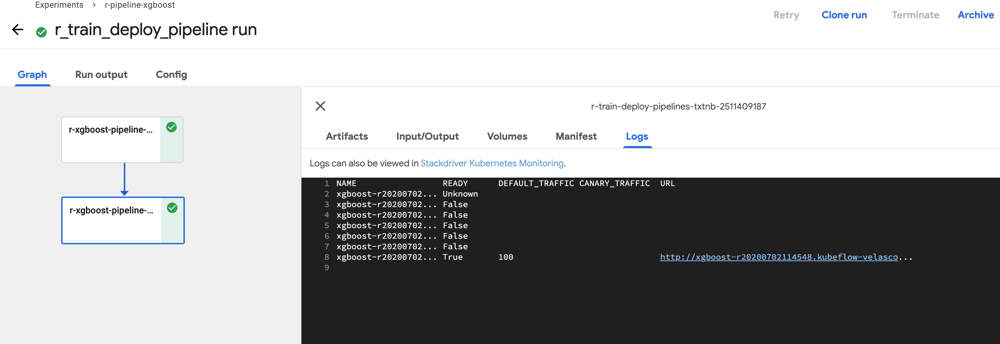

# kubeflow-pipeline-r-fantasia
---
This repository contains a build train deploy example of a XGBOOST model develop with R [kubeflow](https://www.kubeflow.org).

In particular, as of now, this repo features:

- **Pipelines:**
    - Model development withh xgoost using R
    - Model serving from KFServing using the XGboost server
 